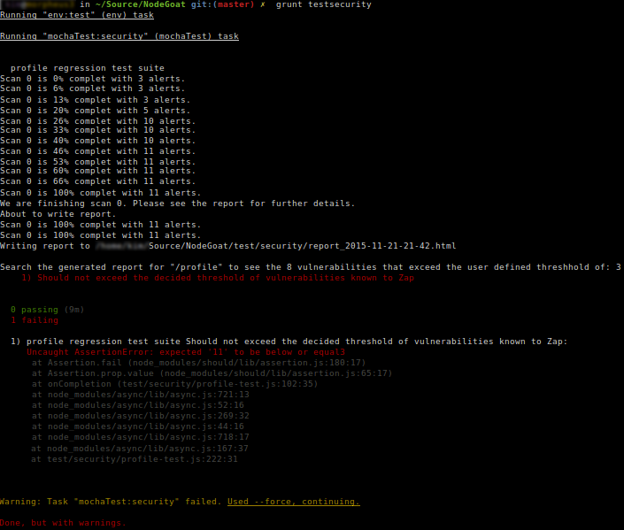
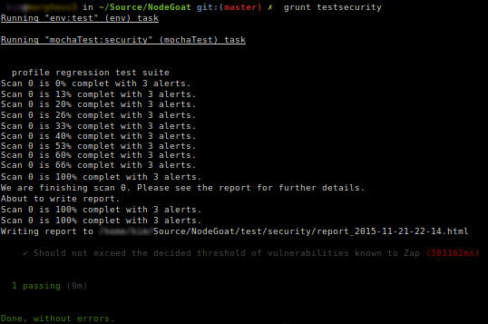

# NodeGoat

Being lightweight, fast, and scalable, Node.js is becoming a widely adopted platform for developing web applications. This project provides an environment to learn how OWASP Top 10 security risks apply to web applications developed using Node.js and how to effectively address them.

## Getting Started
OWASP Top 10 for Node.js web applications: 

### Know it! 
[Tutorial Guide](http://nodegoat.herokuapp.com/tutorial) explaining how each of the OWASP Top 10 vulnerabilities can manifest in Node.js web apps and how to prevent it.

### Do it!
[A Vulnerable Node.js App for Ninjas](http://nodegoat.herokuapp.com/) to exploit, toast, and fix. You may like to [set up your own copy](#how-to-setup-your-copy-of-nodegoat) of the app to fix and test vulnerabilities. Hint: Look for comments in the source code.
##### Default user accounts
The database comes pre-populated with these user accounts created as part of the seed data -
* Admin Account - u:admin p:Admin_123
* User Accounts (u:user1 p:User1_123), (u:user2 p:User2_123)
* New users can also be added using the sign-up page.

## How to Setup Your Copy of NodeGoat

### OPTION 1 - One click install on Heroku
The the quickest way to get running with NodeGoat is to click the button below to deploy it on Heroku.

Even though it is not necessary, it is recommended that you fork this repository and deploy the forked repo.
This would allow you to fix the OWASP Top 10 vulnerabilities demonstarted in the app in your fork and deploy it on heroku mutiple times.

[](https://heroku.com/deploy)

This Heroku instance uses Free ($0/month) node server and MongoLab add-on.

### OPTION 2 - Run NodeGoat on your machine

If you do not wish to run NodeGoat on Heroku, please follow these steps to setup and run it locally - 
* Install [Node.js](http://nodejs.org/) - NodeGoat requires Node v0.10 or above

* Clone the github repository
```
git clone https://github.com/OWASP/NodeGoat.git
```

* Install node modules
```
npm install
``` 

* Create Mongo DB: 
    You can create a remote MongoDB instance or use local mongod installation
    * A. Using Remote MongoDB
        * Create a sandbox mongoDB instance (free) at [MongoLab](https://mongolab.com/plans/pricing/)
        * Create a new database. 
        * Create a user.
        * Update the `db` property in file `config/env/development.js` to reflect your DB setup. (in format: `mongodb://<username>:<password>@<databasename>`)
    * OR B.Using local MongoDB 
        * If using local Mongo DB instance, start [mongod](http://docs.mongodb.org/manual/reference/program/mongod/#bin.mongod). 
        * Update the `db` property in file `config/env/development.js` to reflect your DB setup. (in format: `mongodb://localhost:27017/<databasename>`)

* Populate MongoDB with seed data required for the app
    * Run grunt task below to populate the DB with seed data required for the application. Pass the desired environment as argument. If not passed, "development" is the default:
```
grunt db-reset:development
```
* Start server, this starts the NodeGoat application at url [http://localhost:4000/](http://localhost:4000/)
```
npm start
```

### OPTION 3 - Run NodeGoat on Docker

**You need to install [docker](https://docs.docker.com/installation/) and [docker compose](https://docs.docker.com/compose/install/) to be able to use this option**

The repo includes the Dockerfile and docker-compose.yml necessary to setup the app and the db instance then connect them together.

* Build the images:
```
docker-compose build
```
* Run the app:
```
docker-compose up
```


#### Customizing the Default Application Configuration
The default application settings (database url, http port, etc.) can be changed by updating the [config file] (https://github.com/OWASP/NodejsGoat/blob/master/config/env/all.js).

&nbsp;

### Optional Security Regression Testing with Zap API


&nbsp;

The Zap API should work with any of the above [setup options](#how-to-setup-your-copy-of-nodegoat), although these details are specific to [Option 2 - Run NodeGoat on your machine](#option-2---run-nodegoat-on-your-machine). Following are the details used to get OWASP Zap API regression testing NodeGoat. Specifically only the applications profile page at this stage.

&nbsp;

&nbsp;

#### Zap Installed on Another Machine.

In this case Zap is on a VirtualBox guest, although in practise it shouldn't matter where Zap is running from. For example it's known that Zap will run against Wavsep in a single AWS instance, each in their own Docker containers.

##### NodeGoat running on your local machine

In VirtualBox you will need a Host-only Network added. By default this will be called `vboxnet0` in your VirtualBox settings. an `ifconfig` on the host will reveal a new network interface called `vboxnet0`. This allows guests and host to communicate with each other without anyone outside of the host network interface being able to see the communications. In this example we set the Adapter IP address to `192.168.56.1`. That address will be assigned to your host as an additional network interface.

With this step taken, you will also need to make sure the `hostName` property in the `config/env/all.js` is set to the same IP address, as this IP address is used in the regression test(s) to inform the selenium web driver where our NodeGoat is listening from. In addition to that, requests are proxied through the Zap API to this same address.

In this example we enable the DHCP server on the Host-only Network by just checking the checkbox. The DHCP address will be `192.168.56.2`

If you have a firewall running, You will need to allow TCP in on interface `vboxnet0`. From: `192.168.56.0/24` To: `192.168.56.1` on port `4000` (NodeGoat) and `35729` (LiveReload)

##### Zap running on a local VirtualBox guest

On the guest machine in the VirtualBox Network settings, set one of the Adapter tabs so that the network adapter is attached to Host-only Adapter. Once the networking is restarted on this guest, it will have a network interface bound to something like `192.168.56.20` (specified by the `192.168.56.0/24` range decided above when you setup the `vboxnet0` interface).

The Zap local proxy will need to be bound to the same IP address and port that the guest Host-only adapter is bound to in order to have requests it receives sent via the Host-only adapter to the host that NodeGoat is listening on. `192.168.56.1` in this example. So you can set the Zap local proxy and port to `192.168.56.20` and `8080` for this example via the Zap GUI:  
Tools -> Options -> Local proxy.  
The other way to do it is via the `~/ZAP/config.xml` file in the following section:
```
<proxy>
   <ip>192.168.56.20</ip>
   <port>8080</port>        
</proxy>
```

Update the `zapHostName` and `zapPort` properties in file `config/env/test.js` to reflect the host name (or IP address) and port that the Zap API is listening on within your virtual guest. If you want to debug the security regression tests, add the same properties to the `config/env/development.js` file.

Start Zap the usual way. Zap can and probably should be scripted to start automatically on each test or suite run, also reset the database so you have a known state if you are planning on using the API in your development team. Zap can be terminated via its API and is usually good practice to do so on each test or suite run. If you don't have a UI:
```
owasp-zap -daemon
```

##### Start the Security Regression test(s) from your local machine

For each test run, this is the usual set of steps:
```
# In one terminal create clean state in datastore:
grunt db-reset
# Then start NodeGoat:
npm start
```

```
# In another terminal start the security regression test(s):
grunt testsecurity
```

By default the XSS vulnerabilities exist in the `/profile` route. By running `grunt testsecurity`, the `test/security/profile-test.js` will be run and you should be informed of a failed test with the following output:



Once you:

1. Fix the XSS vulnerabilities in the `/profile` route, explained in the [Tutorial Guide](http://nodegoat.herokuapp.com/tutorial/a3#source-code-example)
2. Restart Zap
3. Reset the datastore
4. Restart NodeGoat
5. Rerun the security regression test(s)

You should be informed of a successful test with the following output:



&nbsp;

## Report bugs, Feedback, Comments
*  Open a new [issue](https://github.com/OWASP/NodeGoat/issues) or contact team by joining chat at [Slack](https://owasp.slack.com/messages/project-nodegoat/) or [](https://gitter.im/OWASP/NodeGoat?utm_source=badge&utm_medium=badge&utm_campaign=pr-badge&utm_content=badge)

## Contributing
Contributions from community are key to make NodeGoat a high quality comprehensive resource. Lets make NodeGoat awesome together!

### Ways to Contribute
Depending on your preference, you can contribute in various ways. Here are tasks planned for [upcoming release](https://github.com/OWASP/NodeGoat/milestones).
You can also open an issue, sending a PR, or get in touch on [Gitter Chat](https://gitter.im/OWASP/NodeGoat) or [Slack](https://owasp.slack.com/messages/project-nodegoat/) 

If sending PR, once code is ready to commit, run: 
```
grunt precommit
```
This command uses `js-beautifier` to indent the code and verifies these [coding standards](https://github.com/OWASP/NodeGoat/blob/master/.jshintrc) using `jsHint`. Please resolve all `jsHint` errors before committing the code.

## Contributors
Here are the amazing [contributors](https://github.com/OWASP/NodeGoat/graphs/contributors) to the NodeGoat project.

## Supports
[](https://www.jetbrains.com/webstorm/)
- Thanks to JetBrains for providing licenses to fantastic webStrom IDE to build this project.

## License
Code licensed under the [Apache License v2.0.](http://www.apache.org/licenses/LICENSE-2.0)
